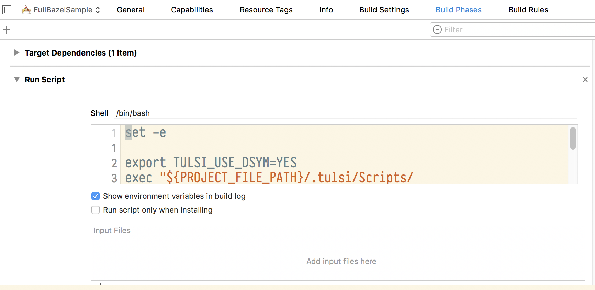
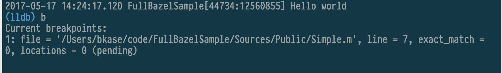

## Working-patcher-branch

This branch contains a project generated by a patched version of Tulsi that supports DSYM debugging when `export TULSI_USE_DSYM=YES` is in the "Run Script" phase for FullBazelSample.

Not only do breakpoints work within the project, but they also work for external dependencies (I used PINFuture as an example).

Below is the README that is present on master, but it no longer holds for this branch.

---

## Basic debugging not working in Tulsi

Track issue here: https://github.com/bazelbuild/tulsi/issues/16

----

I created and generated a simple Xcode project (checked in) from HEAD of Tulsi (Version 0.4.155646550.20170510).

With Xcode 8.3.2, when running in Debug and a breakpoint on line 7 of "Sources/Public/Simple.m", the breakpoint is not hit

1. In lldbinit mode (without dsym) (default)

Even after building, turning off the breakpoint, restarting xcode, then turning it back on and rebuilding.

2. With the dwarfpatcher (with dsym)

In both cases, if I press pause and inspect breakpoints in lldbinit, this breakpoint is not associated with a particular file.

